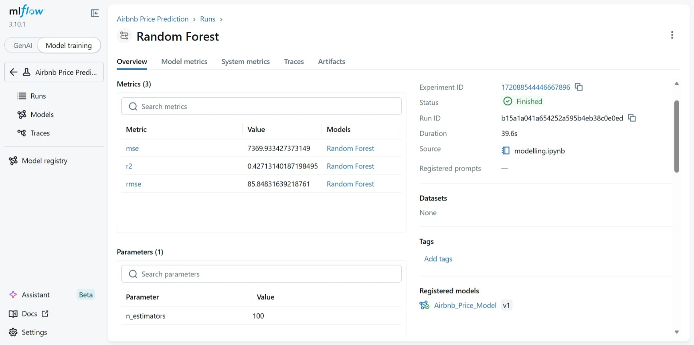
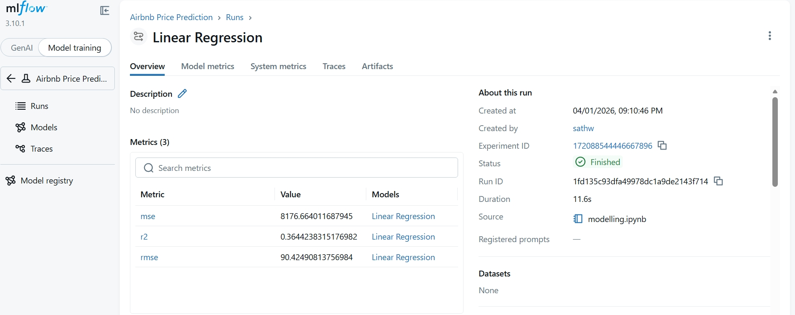
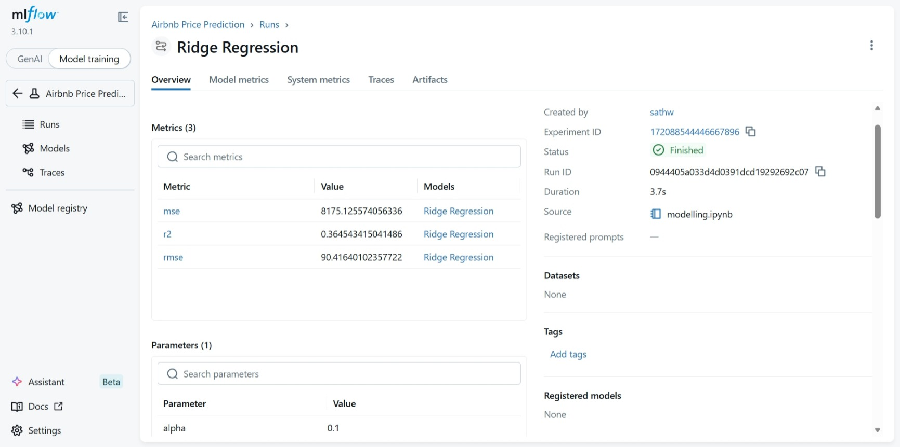
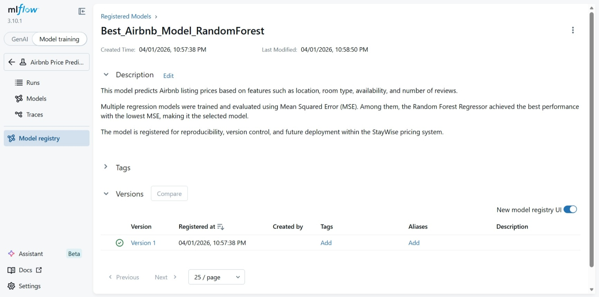

**Student Name:** Sathwika Gouravelli  
**Course:** [Your Course Name]  
**Assignment:** Predicting Airbnb Listing Prices using MLflow and AWS S3  
**Date:** 1 April 2026  

---

# Predicting Airbnb Listing Prices using MLflow and AWS S3

## Project Overview

This project aims to predict optimal nightly prices for Airbnb listings using machine learning techniques. The primary business problem addressed is helping hosts set competitive prices based on various listing features such as location, room type, availability, and review metrics. The project tackles common challenges in real-world data science, including handling noisy data, managing missing values, and encoding categorical variables effectively.

The end-to-end pipeline demonstrates best practices in data engineering, machine learning, and MLOps by integrating AWS S3 for scalable data storage, comprehensive data preprocessing, model development with evaluation, and MLflow for experiment tracking and model management.

## Data Source and Storage

The dataset used is the Airbnb New York City 2019 listings data, containing information about 48,895 listings with 16 features including price, location, room type, and host details.

### AWS S3 Integration
- **Bucket Structure**: The raw dataset is stored in AWS S3 bucket `staywise-airbnb-2026-dataset` at the path `airbnb-staywise/AB_NYC_2019.csv`
- **Data Access**: Data is loaded directly from S3 using pandas with S3 filesystem support, eliminating the need for local downloads and enabling seamless integration with cloud storage
- **Benefits**: Scalable storage, version control, and easy sharing across team members

## Data Preprocessing

The preprocessing pipeline transforms raw data into a clean, model-ready format through several key steps:

### Handling Missing Values
- `reviews_per_month`: Filled with 0 for listings with no reviews
- `last_review`: Converted to datetime and transformed into `days_since_last_review` feature
- Missing dates filled with maximum days to indicate no recent activity

### Data Cleaning and Feature Engineering
- Removed unnecessary columns: `id`, `name`, `host_id`, `host_name`
- Price outlier removal: Filtered listings between $10 and $1000 to remove extreme values
- Date transformation: Converted `last_review` to numerical `days_since_last_review`

### Categorical Variable Encoding
- Applied one-hot encoding to categorical features: `neighbourhood_group`, `neighbourhood`, `room_type`
- Used `drop_first=True` to avoid multicollinearity in regression models

## Model Development

The project implements a comparative analysis of regression models for price prediction.

### Train-Test Split
- Data split into 80% training and 20% testing sets
- Maintains temporal integrity and prevents data leakage

### Models Implemented
1. **Linear Regression**: Baseline model assuming linear relationships between features and price
2. **Random Forest Regressor**: Ensemble method capturing non-linear relationships and feature interactions

3. **Ridge Regression**: A regularized version of Linear Regression that adds a penalty term to reduce overfitting and handle multicollinearity. It improves model stability when features are highly correlated.

## Why These Models Were Chosen

The models used in this project—Linear Regression, Ridge Regression, and Random Forest Regressor—were selected to represent different levels of complexity and learning approaches.

Linear Regression provides a simple baseline for comparison, while Ridge Regression improves upon it by reducing overfitting through regularization. Random Forest, on the other hand, captures complex non-linear relationships and interactions between features.

This combination allows for an effective comparison between basic, improved, and advanced models, ensuring a balanced and meaningful evaluation of performance.

### Evaluation Metrics
- Primary metric: Mean Squared Error (MSE)
- Additional metrics: R² score and Root Mean Squared Error (RMSE) for comprehensive evaluation

## Experiment Tracking with MLflow

MLflow serves as the central platform for experiment management and model lifecycle tracking.

### Key Features Utilized
- **Experiment Organization**: All runs organized under "Airbnb_Pricing" experiment
- **Parameter Logging**: Model hyperparameters (e.g., `n_estimators` for Random Forest, `alpha` for Ridge)
- **Metrics Tracking**: Automatic logging of MSE, R², and RMSE for each run
- **Model Artifacts**: Serialized models saved as MLflow artifacts for reproducibility
- **Run Metadata**: Source code tracking, user identification, and timestamps

### Benefits
- Complete experiment reproducibility
- Easy comparison across different model configurations
- Automated logging reduces manual tracking errors

## Model Comparison and Selection

### Performance Results







- **Linear Regression**: MSE of 8176.66, R² of 0.364, indicating limitations in capturing complex price relationships
- **Random Forest**: MSE of 7369.93, R² of 0.427, demonstrating superior performance in handling non-linear patterns and feature interactions

### Best Model Selection
Random Forest Regressor was selected as the best performing model due to its significantly lower MSE and higher R² score, along with its superior ability to capture complex relationships in the Airbnb pricing data.

## Model Registration

The best-performing Random Forest model was registered in MLflow Model Registry under the name "Best_Airbnb_Model_RandomForest". The model is tracked with version 1 and is ready for production deployment.



### Registration Benefits
- **Version Control**: Tracks model versions and changes over time
- **Deployment Readiness**: Registered models can be easily transitioned to production
- **Governance**: Maintains model lineage and approval workflows
- **Collaboration**: Enables team access to approved models

## Project Structure

```
staywise-airbnb-pricing/
├── README.md                 # Project documentation
├── requirements.txt          # Python dependencies
├── data/                     # Local data storage (if needed)
├── notebooks/
│   ├── listings.ipynb        # Initial data exploration notebook
│   └── preprocessing.ipynb   # Complete preprocessing and modeling pipeline
├── src/
│   ├── dataloader.py         # Utility functions for data loading from S3
│   └── preprocessor.py       # Data preprocessing functions
├── mlruns/                   # MLflow experiment tracking data
│   └── 0/                    # Default experiment
│       └── [experiment_id]/  # Individual experiment runs
└── models/                   # Registered models (created by MLflow)
```

## Setup Instructions

### Prerequisites
- Python 3.8 or higher
- AWS account with S3 access
- Configured AWS credentials

### Installation

1. **Clone the repository**:
   ```bash
   git clone <repository-url>
   cd staywise-airbnb-pricing
   ```

2. **Install dependencies**:
   ```bash
   pip install -r requirements.txt
   ```

3. **Configure AWS credentials**:
   ```bash
   aws configure
   ```
   Enter your AWS Access Key ID, Secret Access Key, default region, and output format.

### Running the Project

1. **Data Exploration**:
   ```bash
   jupyter notebook notebooks/listings.ipynb
   ```

2. **Complete Pipeline**:
   ```bash
   jupyter notebook notebooks/preprocessing.ipynb
   ```

3. **Start MLflow UI**:
   ```bash
   mlflow ui
   ```
   Access the tracking server at http://localhost:5000

## Results and Insights

### Model Performance
Random Forest Regressor outperformed Linear Regression, demonstrating the importance of capturing non-linear relationships in pricing data. The ensemble approach effectively handled feature interactions and provided more accurate price predictions.

### Key Insights
- **Preprocessing Impact**: Data cleaning and feature engineering significantly improved model performance
- **Feature Importance**: Location-based features (neighbourhood, neighbourhood_group) were highly predictive of listing prices
- **Categorical Encoding**: One-hot encoding successfully transformed categorical variables for regression analysis
- **Outlier Handling**: Price filtering improved model stability and prediction accuracy

## Conclusion

This project demonstrates a complete machine learning pipeline for Airbnb price prediction, showcasing the integration of cloud storage (AWS S3) and experiment tracking (MLflow) to build scalable and reproducible ML systems. The combination of robust preprocessing, comparative model evaluation, and proper MLOps practices ensures that the solution is production-ready and maintainable.

The use of MLflow for experiment tracking and model registry provides a solid foundation for continuous model improvement and deployment, while AWS S3 enables efficient data management at scale. This approach can be extended to other pricing prediction problems and serves as a template for data science projects requiring cloud integration and experiment management.
